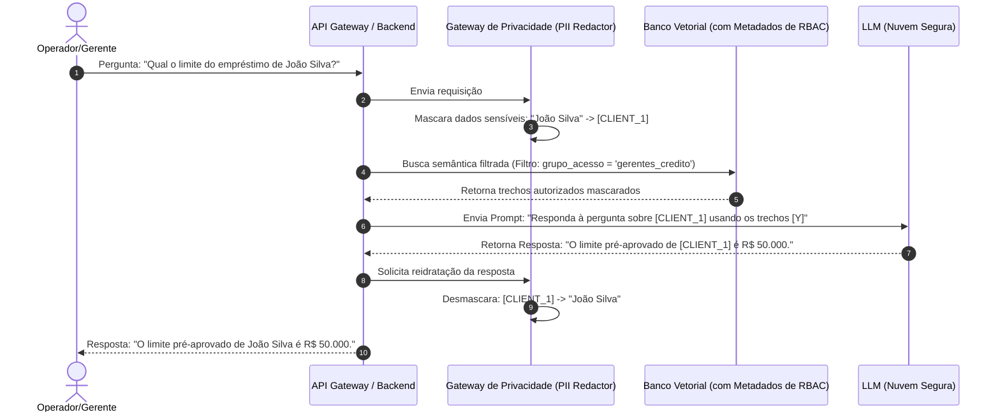

# 🏗️ Arquitetura de Integração de IA em Sistemas Bancários

A arquitetura de sistemas com IA em ambientes financeiros difere de arquiteturas genéricas pela presença mandatória de camadas de controle de privacidade, segurança transacional e conformidade regulatória.

---

## 🔍 1. RAG Seguro com RBAC (Filtro por Nível de Acesso)

Em bancos, nem todas as informações internas podem ser acessadas por todos os colaboradores. O RAG Bancário deve integrar o controle de acesso baseado em papéis (RBAC - Role-Based Access Control) diretamente na busca semântica:



*   **Metadata Filtering:** Cada documento no banco vetorial possui metadados com as tags de permissão (ex: `{"roles_permitidos": ["diretoria", "risco"]}`). O backend injeta essa restrição na query de busca semântica para impedir vazamento de documentos confidenciais.

---

## 🛡️ 2. Gateway de Privacidade (PII Redaction Engine)

Camada arquitetural obrigatória posicionada entre o backend do banco e a API do LLM externo. Sua função é garantir o cumprimento do Sigilo Bancário e LGPD.

*   **Fase de Envio (Redaction):**
    *   O motor intercepta o prompt e usa expressões regulares (regex) combinadas com modelos locais de Reconhecimento de Entidade Nomeada (NER) treinados em português.
    *   Substitui dados sensíveis por tokens sintáticos estáveis:
        *   `Carlos Eduardo` $\rightarrow$ `[NAME_1]`
        *   `322.455.123-09` $\rightarrow$ `[CPF_1]`
        *   `Conta: 12345-6` $\rightarrow$ `[ACCOUNT_1]`
*   **Fase de Retorno (Rehydration):**
    *   O gateway mantém um mapa temporário em memória (ex: Redis com TTL curto) associando os tokens aos dados reais.
    *   Ao receber a resposta do LLM, substitui de volta os tokens pelos valores reais antes de entregar a resposta na tela do cliente.

---

## 🤖 3. Padrão Agêntico Transacional com HITL (Human-in-the-Loop)

Nenhum agente de IA em sistema bancário deve ter permissão de escrita direta ou liquidação financeira de forma 100% autônoma. O padrão de arquitetura deve exigir uma confirmação humana explícita.

```
[Cliente no Chat]
"Quero fazer um Pix de 100 reais para o meu irmão."

     │  (1) Identificação de Intenção e Parâmetros
     ▼
[Agente de IA]
Analisa o prompt e monta a proposta em JSON (sem executar a transação):
{
  "action": "TRANSFERENCIA_PIX",
  "status": "AWAITING_HITL_CONFIRMATION",
  "arguments": {
    "valor": 100.00,
    "destinatario": "Irmão (Chave Pix CPF: ***.321.***-**)"
  }
}

     │  (2) Intercepção de Segurança do Backend
     ▼
[Backend Core Banking]
Identifica que a ação é financeira. 
Pausa o fluxo da IA e aciona o módulo de autenticação.

     │  (3) Fluxo de Confirmação do Cliente (HITL)
     ▼
[Interface do App Bancário]
Exibe uma tela nativa segura:
"Confirmar Pix de R$ 100,00 para [Destinatário]?
Por favor, digite sua senha de 6 dígitos ou biometria."

     │  (4) Liquidação e Resposta
     ▼
[Cliente digita a senha] ──> Transação liquidada com segurança no banco ──> IA notificada e responde no chat com sucesso.
```

---

## 📊 4. Logs de Auditoria e Explicabilidade (XAI Ledger)

Todos os passos tomados pelo agente de IA (pensamentos, chamadas de ferramentas e prompts montados) devem ser gravados em logs estruturados imutáveis. Isso permite auditoria forense caso o Banco Central ou um cliente questione as decisões tomadas pelo sistema inteligente.
