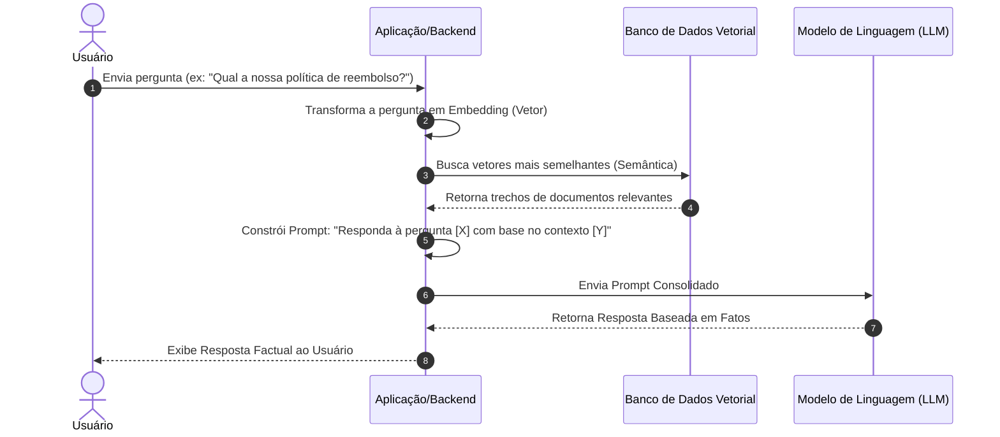

# 🏗️ Arquitetura de Sistemas Integrados com IA

Integrar modelos de linguagem (LLMs) em sistemas de produção exige padrões de arquitetura de software específicos que garantam desempenho, segurança, custo controlado e consistência das respostas.

---

## 🔍 Padrão 1: Retrieval-Augmented Generation (RAG)

O **RAG (Geração Aumentada de Recuperação)** é a arquitetura padrão para alimentar o LLM com dados atualizados, dinâmicos ou privados, sem a necessidade de realizar um treinamento ou ajuste fino dispendioso do modelo.

### Fluxo de Funcionamento do RAG:



*   **Chunking (Divisão em Blocos):** Técnica de quebrar documentos longos em pedaços menores (ex: 500 caracteres com 10% de sobreposição) para caber na janela de contexto e otimizar a busca vetorial.
*   **Vector Database:** Bancos especializados (como Pinecone, Milvus, Qdrant, PGVector) que realizam busca por cosseno ou distância euclidiana em representações vetoriais de texto (embeddings).

---

## ⚙️ Padrão 2: Chamada de Função (Function Calling / Tool Use)

Permite conectar LLMs a APIs externas, bancos de dados relacionais e sistemas legados. O modelo não executa o código diretamente, mas atua como o tomador de decisão que define *quando* e *como* chamar uma função externa.

```
Usuário: "Qual o status do meu pedido 12345?"
  └── LLM analisa o prompt e suas ferramentas declaradas.
  └── LLM responde com JSON estruturado (sem gerar texto livre):
      {
        "name": "obter_status_pedido",
        "arguments": { "id_pedido": 12345 }
      }
  └── Sistema Backend intercepta o JSON, executa a consulta no banco de dados SQL.
  └── Sistema Backend envia o resultado da consulta de volta para o LLM.
  └── LLM formata o resultado em linguagem natural para o usuário:
      "Seu pedido 12345 já foi enviado e está a caminho da transportadora."
```

---

## 🤖 Padrão 3: Arquitetura de Agentes (Agentic Workflows)

Em vez de usar uma única chamada de prompt, os agentes de IA usam loops iterativos onde executam ações, avaliam os resultados e planejam os próximos passos de forma dinâmica.

*   **Padrão ReAct (Reasoning and Acting):** O agente alterna entre gerar um pensamento sobre o problema e executar uma ação externa.
*   **Multi-Agentic Workflows:** Divisão de um problema complexo em sub-tarefas executadas por agentes com papéis bem definidos (ex: Agente Desenvolvedor, Agente Revisor, Agente de Testes).
*   **Reflection (Reflexão):** Padrão de design onde um modelo avalia e critica a própria resposta gerada (ou a resposta de outro modelo) para corrigir erros antes de exibir o resultado final ao usuário.

---

## 🛡️ Padrão 4: Caching e Guardrails (Camadas de Controle)

Para levar um sistema com LLM para produção, duas camadas adicionais de arquitetura são fundamentais:

1.  **Semantic Caching (Cache Semântico):**
    *   *Objetivo:* Economizar custos e reduzir a latência.
    *   *Como funciona:* Salva as perguntas dos usuários e as respostas correspondentes da IA. Se um novo usuário fizer uma pergunta semanticamente idêntica (ex: "Como redefinir senha?" vs "Quero resetar minha senha"), o sistema retorna o cache em milissegundos sem chamar a API do LLM novamente.
2.  **Guardrails (Barreiras de Proteção):**
    *   *Objetivo:* Garantir conformidade, segurança e evitar vazamento de dados confidenciais.
    *   *Como funciona:* Ferramentas intermediárias (ex: Guardrails AI, NeMo Guardrails) validam a entrada (prompt injection, tópicos banidos) e inspecionam a saída antes de ser enviada ao usuário final (garantindo que o formato JSON esteja correto ou que não haja dados confidenciais sendo expostos).
