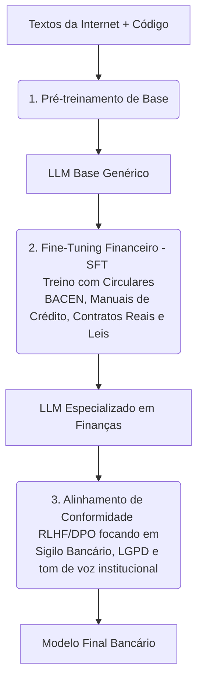

# ⚡ Entendendo Large Language Models (LLMs) em Finanças

Os Large Language Models (LLMs) trazem capacidades cognitivas cruciais para o ecossistema bancário. No entanto, o treinamento, o deploy e a escolha das arquiteturas neurais devem respeitar padrões rigorosos de segurança de dados e conformidade financeira.

---

## 🏛️ Ciclo de Treinamento de LLMs com Domínio Financeiro

Para que um LLM seja útil em tarefas de core banking ou auditoria de riscos, seu ciclo de treinamento precisa ser enriquecido com conhecimento de domínio:

1.  **Pré-treinamento:** O modelo absorve sintaxe básica de programação e linguagem natural.
2.  **Fine-Tuning Financeiro (SFT):** O modelo é ajustado em pares de dados de alta qualidade sobre contabilidade, direito bancário, regras do Open Finance, layouts de arquivos CNAB e rotinas de liquidação de pagamentos.
3.  **Alinhamento de Conformidade (RLHF/DPO):** O modelo é treinado para recusar explicitamente a revelação de informações confidenciais de outros clientes, evitar comportamentos de aconselhamento de investimento não certificado (conforme regras da CVM) e mitigar preconceitos em análises sociais.

---

## 🔒 Arquiteturas de Deploy e Privacidade de Dados Bancários

A escolha de onde hospedar e rodar um LLM é ditada pelas regulações de sigilo bancário. Existem duas abordagens principais na arquitetura corporativa:

### A. Nuvem Pública Privada com Gateways de Criptografia (Ex: Azure OpenAI / AWS Bedrock)
*   **Abordagem:** O banco consome APIs de grandes provedores, mas estabelece conexões exclusivas (Private Links/VPNs) e garante contratualmente que as consultas não serão utilizadas para treinar modelos globais.
*   **Segurança:** Utiliza um gateway interno de **PII Redaction** para limpar dados sensíveis dos clientes antes de enviar a consulta para o endpoint na nuvem.

### B. Hospedagem Local / Nuvem Privada (On-Premise / Self-Hosted)
*   **Abordagem:** O banco faz o deploy de modelos Open-Source altamente capazes (como LLaMA 3 70B, Mistral, Command R+) em sua própria infraestrutura de hardware (GPUs locais ou instâncias de nuvem privada sob controle total do banco).
*   **Segurança:** Controle total do tráfego de rede. Ideal para análise de dados brutos e transações confidenciais que não podem sair da rede de forma alguma.

---

## 🔄 Aplicações Bancárias por Tipo de Transformer

Diferentes tarefas bancárias se beneficiam de diferentes arquiteturas baseadas em Transformers:

1.  **Decoder-Only (GPT, Claude, LLaMA):**
    *   *Uso Bancário:* Geração de contratos, redação de defesas jurídicas prévias, automação de respostas no suporte ao cliente e escrita de código para microsserviços de pagamento.
2.  **Encoder-Only (BERT, RoBERTa):**
    *   *Uso Bancário:* Classificação semântica de transações, análise de sentimentos dos clientes em redes sociais para prevenção de crises e extração de entidades nomeadas (NER) de extratos PDF (como identificar datas de pagamento, CNPJ e valores).
3.  **Encoder-Decoder (T5, BART):**
    *   *Uso Bancário:* Tradução de formatos legados. Altamente eficiente para converter layouts de arquivos CNAB 240/400 (padrões antigos de cobrança por arquivo) para payloads JSON modernos compatíveis com APIs de Open Finance, ou tradução de linguagens (COBOL para Java).
