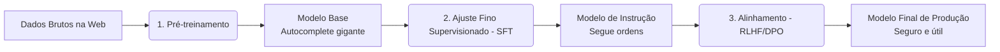

# ⚡ Entendendo Large Language Models (LLMs)

Os **Large Language Models (LLMs)** são redes neurais artificiais massivas baseadas na arquitetura Transformer, com bilhões ou até trilhões de parâmetros ajustáveis. Eles são capazes de processar, compreender e gerar linguagem natural ou código em uma grande variedade de tarefas.

---

## 🏗️ O Ciclo de Treinamento de um LLM

Os modelos que utilizamos comercialmente (como GPT-4, Claude 3.5, Gemini 1.5, LLaMA 3) não são criados prontos para responder perguntas. Eles passam por três etapas críticas de aprendizado:

### 1. Pré-treinamento (Pre-training)
*   **O que faz:** O modelo lê gigabytes/terabytes de textos públicos da internet, livros, código-fonte e artigos científicos. Sua única tarefa é prever o próximo token na frase de forma auto-supervisionada.
*   **Resultado:** O **Modelo Base (Base Model)**. Ele é extremamente bom em autocompletar texto, mas não sabe responder perguntas de forma amigável ou manter diálogos (se você perguntar "Qual a capital da França?", ele pode responder com uma lista de outras perguntas de geografia do tipo vestibular).

### 2. Ajuste Fino Supervisionado (SFT - Supervised Fine-Tuning)
*   **O que faz:** O modelo base é treinado em um conjunto de dados curado, contendo exemplos específicos de formato "Instrução/Pergunta" $\rightarrow$ "Resposta Ideal".
*   **Resultado:** O **Modelo de Instrução (Instruction-Tuned Model)**. Ele aprende a se comportar como um assistente prestativo e a estruturar respostas de forma lógica.

### 3. Alinhamento (RLHF ou DPO)
*   **O que faz:**
    *   **RLHF (Reinforcement Learning from Human Feedback):** O modelo gera múltiplas respostas para uma pergunta e humanos (ou outras IAs avançadas) classificam quais respostas são melhores. Um modelo de recompensa é criado para treinar o LLM a preferir o comportamento seguro e útil.
    *   **DPO (Direct Preference Optimization):** Uma técnica mais moderna que otimiza o modelo diretamente com pares de dados de preferência sem precisar de um modelo de recompensa intermediário.
*   **Resultado:** O **Modelo Alinhado (Chat Model)**. Pronto para uso seguro pelo público geral, evitando discursos de ódio, alucinações óbvias e instruções perigosas.

---

## 🔄 Variações da Arquitetura Transformer

A arquitetura Transformer original possui uma parte de codificação (Encoder) e uma de decodificação (Decoder). Dependendo de como essas partes são usadas, os LLMs são classificados em:

1.  **Decoder-Only (Apenas Decodificador):**
    *   *Exemplos:* GPT-3/4, Claude, LLaMA, Mistral, Gemini.
    *   *Foco:* Geração autorregressiva de texto. O modelo recebe um prompt e gera a continuação, palavra por palavra. É o padrão da indústria para chatbots e assistentes de código.
2.  **Encoder-Only (Apenas Codificador):**
    *   *Exemplos:* BERT, RoBERTa.
    *   *Foco:* Compreensão e classificação. Eles leem o texto completo bidirecionalmente (da esquerda para a direita e vice-versa) para extrair entidades, classificar sentimentos ou criar embeddings de alta qualidade.
3.  **Encoder-Decoder (Codificador-Decodificador):**
    *   *Exemplos:* T5, BART.
    *   *Foco:* Tarefas de tradução e resumo (seq2seq), onde há um texto de entrada complexo que precisa ser mapeado para um texto de saída totalmente diferente.

---

## 🧩 Tokenização e Janela de Contexto

*   **Tokenização:** LLMs não leem texto diretamente; eles leem números. O texto de entrada é dividido em pequenos fragmentos chamados **tokens** por meio de um algoritmo de tokenização (como BPE - Byte-Pair Encoding). Cada token é associado a um número de um vocabulário fixo (geralmente entre 32.000 e 200.000 tokens únicos).
*   **Janela de Contexto (Context Window):** É o limite físico de quantos tokens de memória operacional o modelo consegue ler e lembrar ao mesmo tempo durante a inferência. Modelos modernos possuem janelas enormes (ex: LLaMA 3 tem 8K a 128K, Claude 3 tem 200K, Gemini 1.5 Pro chega a 1M a 2M de tokens de contexto), permitindo analisar livros inteiros ou bases de código completas em uma única requisição.
