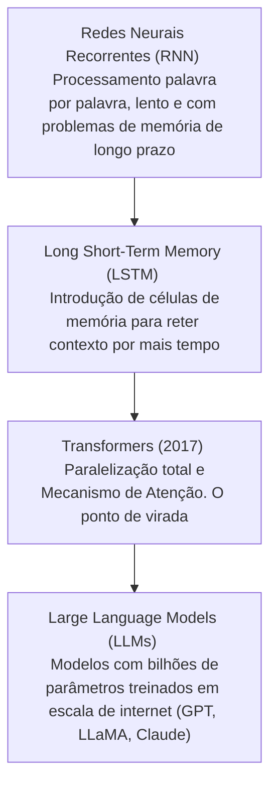

# 🧠 Resumo: Inteligência Artificial Generativa

A **Inteligência Artificial Generativa (GenAI)** é um subcampo da Inteligência Artificial focado na criação de modelos capazes de gerar novos conteúdos originais (como textos, códigos, imagens, áudios e vídeos) que se assemelham a criações humanas, a partir do aprendizado de padrões extraídos de conjuntos massivos de dados.

---

## ⚖️ IA Tradicional (Discriminativa) vs. IA Generativa

Para entender o poder da IA Generativa, é útil compará-la com a abordagem tradicional (discriminativa):

| Característica | IA Tradicional (Discriminativa) | IA Generativa |
| :--- | :--- | :--- |
| **Objetivo** | Classificar, categorizar ou prever com base em dados existentes. | Criar novos dados/conteúdos originais a partir de instruções. |
| **Funcionamento** | Aprende as fronteiras de decisão entre classes. Responde "Isto é A ou B?". | Aprende a distribuição de probabilidade subjacente aos dados. Responde "Como gerar um novo exemplo de A?". |
| **Exemplos** | Filtro de spam, reconhecimento facial, previsão de preços. | Escrever um ensaio, gerar código de software, criar artes visuais. |
| **Input / Output** | Dados estruturados $\rightarrow$ Rótulo/Número | Prompt em linguagem natural $\rightarrow$ Texto, Código, Imagem |

---

## 📈 Evolução Histórica dos Modelos de Texto

A evolução até os modelos modernos de linguagem passou por marcos fundamentais na arquitetura de Processamento de Linguagem Natural (PLN/NLP):



1.  **RNNs e LSTMs:** Antigamente, os modelos liam os textos palavra por palavra de forma sequencial. Isso tornava o treinamento muito lento e impedia que o modelo lembrasse do início de um texto longo quando chegava ao final.
2.  **Transformers (2017):** A grande revolução. A arquitetura Transformer eliminou o processamento estritamente sequencial, permitindo treinar redes neurais com todo o texto de uma vez (paralelização). O mecanismo de *Self-Attention* (Auto-Atenção) permitiu ponderar a relevância de cada palavra em relação a todas as outras do texto, capturando nuances de contexto profundas.

---

## ⚙️ Como a IA Generativa de Texto Funciona?

Modelos de texto generativos (como os GPTs) são **modelos autorregressivos**. Isso significa que eles geram texto de forma iterativa, prevendo **um token por vez**.

```
Input (Prompt): "O gato preto subiu no..."
  └── O modelo calcula a probabilidade para a próxima palavra:
      - "telhado" (85%)
      - "muro" (10%)
      - "carro" (4%)
      - "computador" (1%)
  └── Escolha (ex: "telhado") e inserção no contexto.
Novo Input: "O gato preto subiu no telhado e..."
```

O modelo repete esse processo continuamente até atingir um token de parada especial (`<|endoftext|>` ou similar) ou o limite máximo de tokens configurado.

---

## 🛠️ Parâmetros de Ajuste da Geração

Ao integrar ou utilizar uma API de IA Generativa, configuramos parâmetros que influenciam diretamente como as probabilidades acima são tratadas:

*   **Temperatura (Temperature):**
    *   *Valores baixos (0.0 a 0.3):* Respostas altamente previsíveis, factuais e determinísticas (escolhe quase sempre o token de maior probabilidade). Recomendado para código e dados precisos.
    *   *Valores altos (0.7 a 1.2+):* Respostas criativas, variadas e diversas (dá chance a tokens com menor probabilidade). Recomendado para brainstorming e escrita criativa.
*   **Top-p (Nucleus Sampling):**
    *   Define uma porcentagem acumulada de tokens a considerar. Por exemplo, se `top_p = 0.9`, o modelo só selecionará tokens que estejam dentro dos 90% mais prováveis. Ajuda a eliminar respostas absurdas, mantendo a criatividade.
*   **Frequency Penalty (Penalidade de Frequência):**
    *   Penaliza o modelo com base no número de vezes que um token já apareceu no texto gerado até então. Valores positivos diminuem a probabilidade de repetição de palavras idênticas.
*   **Presence Penalty (Penalidade de Presença):**
    *   Penaliza o modelo se um token já apareceu pelo menos uma vez no texto. Incentiva o modelo a mudar de assunto e introduzir termos novos.
