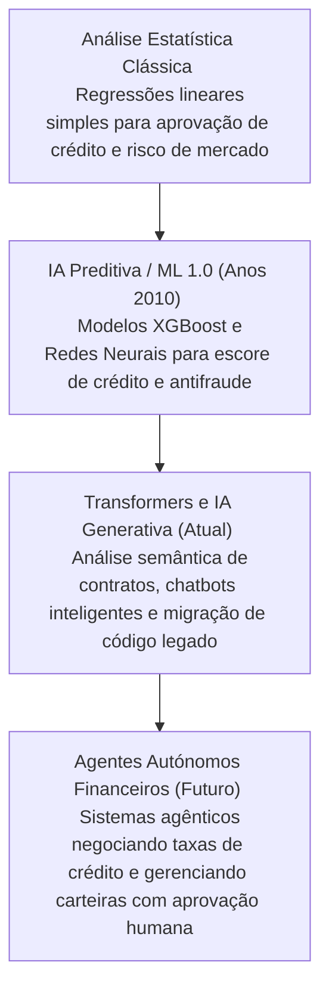

# 🧠 Resumo: Inteligência Artificial Generativa no Setor Bancário

No setor financeiro, a **Inteligência Artificial Generativa (GenAI)** atua como uma camada de cognição avançada sobre sistemas altamente regulados e transacionais. Ela complementa as técnicas clássicas de aprendizado de máquina ao processar e sintetizar grandes volumes de dados não estruturados (como contratos, regulamentos e logs).

---

## ⚖️ IA Tradicional (Preditiva) vs. IA Generativa em Bancos

Embora ambas sejam utilizadas em bancos modernos, suas tarefas e propósitos de negócios são fundamentalmente distintos:

| Caso de Uso | IA Preditiva / Tradicional (Machine Learning) | IA Generativa (GenAI baseada em LLMs) |
| :--- | :--- | :--- |
| **Foco Principal** | Padrões Numéricos, Classificação e Previsão. | Compreensão de Linguagem Natural, Geração e Tradução. |
| **Detecção de Fraude** | Analisa se uma transação Pix de R$ 5.000 às 03:00 destoa do padrão do cliente. | Gera um relatório narrativo de atividade suspeita (SAR) para o regulador financeiro. |
| **Crédito e Risco** | Calcula o *Credit Score* numérico de probabilidade de inadimplência (Default). | Analisa o contrato social de uma empresa para extrair sócios fiadores e restrições. |
| **Atendimento** | Árvores de decisão rígidas (Ura/Chatbots simples baseados em fluxogramas). | Assistentes conversacionais capazes de consultar faturas em tempo real e negociar dívidas. |
| **Engenharia** | Monitoramento de latência e detecção de anomalias em APIs de pagamentos. | Migração automatizada de rotinas de cálculo financeiro em COBOL/Mainframe para Java/Go. |

---

## 📈 A Evolução da Inteligência Artificial em Finanças

A jornada da IA nos bancos passou por diferentes fases, impulsionada pelas necessidades de escala e velocidade:

---

## ⚠️ Desafios Regulatórios e Riscos Setoriais

Bancos operam sob legislações estritas de sigilo e estabilidade sistêmica (como resoluções do BACEN e regras de Basiléia). O uso de IA Generativa expõe o banco a riscos específicos:

1.  **Risco de Alucinação Financeira:** Se a IA alucinar as taxas de juros de um contrato, o banco pode sofrer perdas financeiras severas e processos jurídicos.
2.  **Vazamento de PII (Personally Identifiable Information):** O envio de nomes de clientes e CPFs para APIs de nuvem pública viola o sigilo bancário.
3.  **Viés e Discriminação:** Modelos gerativos não podem perpetuar preconceitos em prompts de concessão de crédito ou triagem de perfil de risco.

---

## 🛠️ Calibração de Parâmetros para Sistemas Financeiros

Ao contrário de aplicações de entretenimento ou marketing, em sistemas bancários a **previsibilidade e o determinismo** são obrigatórios para a maioria das tarefas:

*   **Temperatura = 0.0:** Configuração recomendada para geração de código transacional, interpretação de regras fiscais e geração de JSONs de integração. Garante que o modelo selecione sempre o token mais provável, eliminando variações criativas desnecessárias.
*   **Top-p próximo a 1.0 (ou não configurado):** Quando a temperatura está zerada, o Top-p perde relevância prática, mas deve ser mantido restrito para garantir que o vocabulário financeiro padrão seja preservado.
*   **Presence & Frequency Penalties = 0.0:** Evita penalizar o modelo por repetir termos financeiros obrigatórios repetidamente no mesmo texto (como "saldo", "tarifa", "Pix", "conta").
